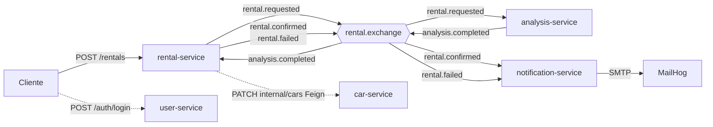
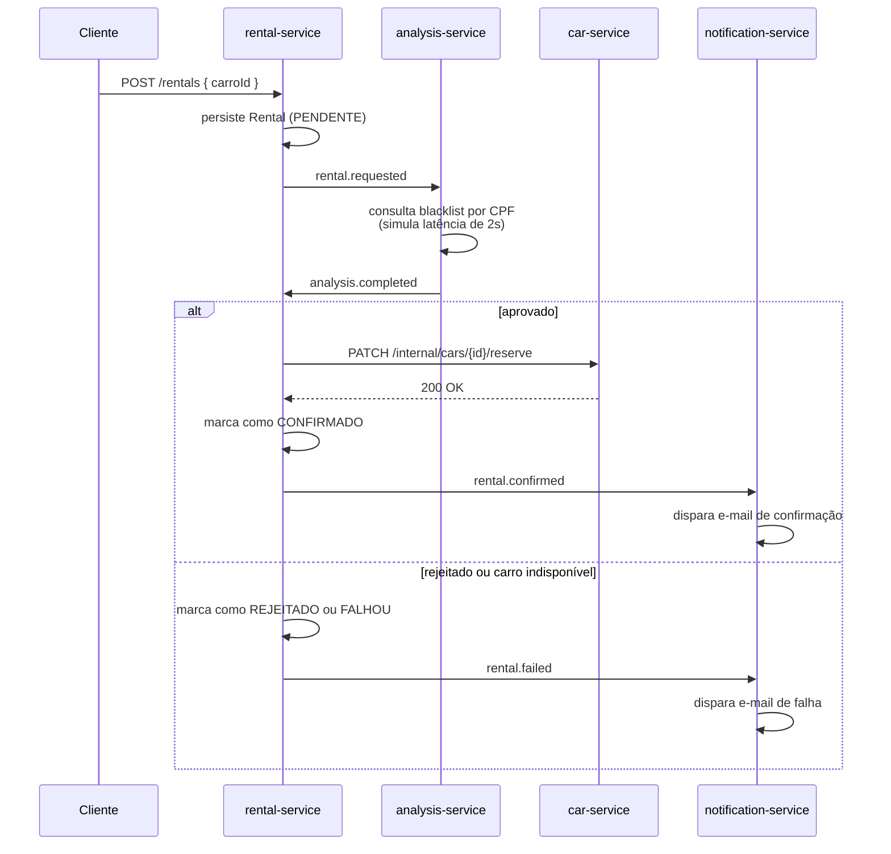
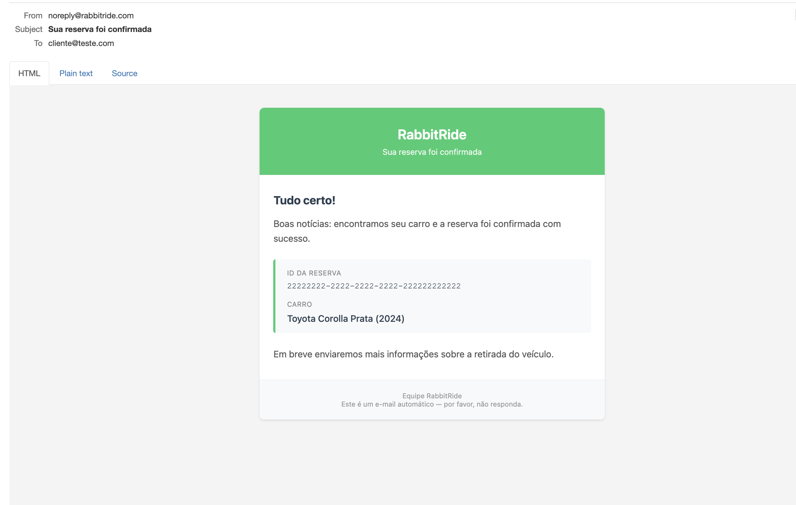
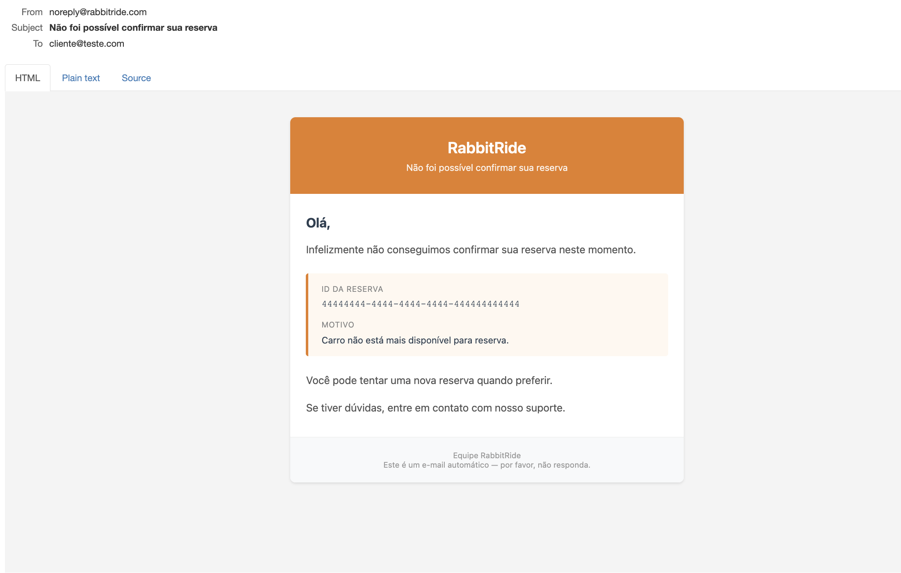

# RabbitRide

[](https://github.com/GGhiaroni/rabbitride/actions/workflows/ci.yml)


Sistema de aluguel de carros event-driven em Spring Boot, construído como laboratório para exercitar mensageria de verdade — a com saga orquestrada, retry com backoff exponencial, dead letter queue, idempotência e dual-write problem assumido. Não é um CRUD com RabbitMQ no meio para enfeitar.

## Por que esse projeto existe

A maioria dos tutoriais de RabbitMQ termina quando a primeira mensagem chega na queue. Em produção, a parte chata começa exatamente aí: o consumer falha, a mensagem volta, falha de novo, entra em loop infinito; o broker entrega a mesma mensagem duas vezes; o JSON da mensagem muda de schema entre serviços; o publish dá certo mas o `save` no banco falha logo depois e ninguém percebe.

O RabbitRide foi escrito para passar por todos esses problemas de propósito. Cada decisão de arquitetura tem uma justificativa registrada — boa parte está nos comentários de PR e no histórico de issues. Quando há trade-off (e quase sempre há), está documentado.

## Arquitetura

Cinco microsserviços, um exchange topic central, RabbitMQ orquestrando os eventos da saga e Feign para o único pedaço síncrono que faz sentido (reservar carro).



Detalhamento completo da topologia AMQP, bindings, DLQ e configuração de retry está em **[docs/messaging.md](docs/messaging.md)**.

## Stack

- Java 17, Spring Boot 3.3, Spring Security, Spring AMQP, Spring Data JPA, Spring Cache, OpenFeign
- Auth0 java-jwt para JWT stateless
- Postgres 16, Redis 7, RabbitMQ 3
- MailHog como SMTP fake para desenvolvimento
- Flyway para migration
- Thymeleaf para templates de e-mail HTML
- Testcontainers, JUnit 5, AssertJ, Mockito, Awaitility para testes
- springdoc-openapi para Swagger UI por serviço
- Docker Compose para orquestrar a infra local
- Maven multi-módulo

## Serviços

| Serviço | Porta | Banco | Responsabilidade |
|---|---|---|---|
| `user-service` | 8081 | Postgres | Cadastro, login, emissão de JWT (claims `userId`, `name`, `cpf`) |
| `car-service` | 8082 | Postgres + Redis | Catálogo de carros, endpoint interno de reserva/liberação |
| `rental-service` | 8083 | Postgres | Orquestrador da saga. Recebe `POST /rentals`, publica `RentalRequested`, consome resultado da análise, chama car-service via Feign |
| `analysis-service` | 8084 | Postgres | Consome `RentalRequested`, consulta blacklist por CPF, publica `AnalysisCompleted` |
| `notification-service` | 8085 | (sem banco) | Consome `RentalConfirmed`/`RentalFailed`, envia e-mail via SMTP |

Todos expõem `/actuator/health` na porta indicada. Os três primeiros expõem também `/swagger-ui/index.html`:

- http://localhost:8081/swagger-ui/index.html (user)
- http://localhost:8082/swagger-ui/index.html (car)
- http://localhost:8083/swagger-ui/index.html (rental)

## Fluxo da saga



A escolha de **misturar assíncrono com síncrono** é deliberada: análise pode demorar e merece retry, então é AMQP; reserva do carro precisa de resposta imediata para evitar overbooking, então é Feign. Saber quando usar cada padrão é parte do exercício.

## Eventos

| Routing key | Publisher | Consumer | Campos relevantes |
|---|---|---|---|
| `rental.requested` | rental-service | analysis-service | `eventId`, `occurredAt`, `rentalId`, `userId`, `userEmail`, `userCpf`, `carroId` |
| `analysis.completed` | analysis-service | rental-service | `eventId`, `occurredAt`, `rentalId`, `resultado` (`APPROVED`/`REJECTED`), `motivo?` |
| `rental.confirmed` | rental-service | notification-service | `eventId`, `occurredAt`, `rentalId`, `userEmail`, `carroDescricao` |
| `rental.failed` | rental-service | notification-service | `eventId`, `occurredAt`, `rentalId`, `userEmail`, `motivo` |

Todo evento traz `eventId` (UUID) e `occurredAt` (`Instant` UTC). O `eventId` é o que viabiliza idempotência (próxima seção).

## Resiliência: retry, DLQ e idempotência

### Retry com backoff exponencial

O analysis-service tem retry stateless configurado via Spring Retry. Em caso de exception no consumer, a mensagem é reprocessada na própria thread antes de ser rejeitada definitivamente.

Parâmetros (`application.yml`, sob `app.retry`):

| Parâmetro | Valor | Significado |
|---|---|---|
| `max-attempts` | 3 | Total de tentativas (1 inicial + 2 retries) |
| `initial-interval-ms` | 1000 | Espera entre 1ª e 2ª tentativa |
| `multiplier` | 2.0 | Fator de crescimento exponencial |
| `max-interval-ms` | 10000 | Teto absoluto entre tentativas |

Curva real: tentativa 1, falha, espera 1s, tentativa 2, falha, espera 2s, tentativa 3, falha, vai para DLQ. Aproximadamente 3 segundos até o dead-lettering completo.

Backoff exponencial é a escolha certa porque problemas transientes (banco sobrecarregado, blip de rede) tendem a se resolver em poucos segundos — esperar 1s, depois 2s, depois 4s dá tempo de o recurso se recuperar, em vez de bombardear com retries no mesmo milissegundo.

### Dead Letter Queue

Toda queue principal tem o argumento `x-dead-letter-exchange` apontando para `rental.dlx`. Quando o retry esgota e a mensagem é rejeitada com `requeue=false`, o RabbitMQ a roteia automaticamente para o DLX, que está bound à `rental.dlq` via wildcard `#`. Resultado: uma única DLQ central que captura falhas de qualquer queue.

Mensagens no DLQ não são reprocessadas. A ação manual de operação é inspecionar a mensagem no console RabbitMQ (`http://localhost:15672`), identificar a causa raiz e, se aplicável, republicar.

### Idempotência

Consumers que publicam efeitos colaterais usam uma tabela `processed_event` com `event_id` como PK natural. Antes de processar, `existsById(eventId)` decide se ignora ou prossegue. No final do fluxo, `save(new ProcessedEvent(eventId, consumerName))` registra a entrega. Tudo dentro de `@Transactional` para garantir que, se algo falhar no meio, o registro também não é salvo.

Isso resolve o caso do at-least-once delivery do AMQP (mensagem chega duas vezes, processada uma só).

**Limitação assumida**: a publicação no RabbitMQ não é parte da transação JPA (clássico dual-write problem). Em caso de crash entre `convertAndSend` e o `save` em `processed_event`, há uma janela onde a mensagem pode ser publicada duas vezes em uma redelivery. Isso é mitigado pela idempotência dos consumers downstream. A solução completa seria adotar **Transactional Outbox** — fica registrado como melhoria futura, fora do escopo da v1.

## Notificações por e-mail

O notification-service consome `rental.confirmed` e `rental.failed` em queues separadas (uma consumer class por tipo, single responsibility) e dispara e-mails HTML via SMTP usando MailHog em desenvolvimento.

Os templates ficam em `services/notification-service/src/main/resources/templates/email/` e são renderizados com Thymeleaf. Estilo inline e layout em tabela — convenção histórica para máxima compatibilidade com clientes de e-mail (Outlook ainda existe).

### Reserva confirmada



Verde para sucesso, card com detalhes da reserva, ID em mono para deixar claro que é identificador técnico.

### Reserva não confirmada



Laranja em vez de vermelho (alerta, não erro), motivo da falha exibido com transparência, caminhos de ação claros para o cliente seguir adiante.

## Como rodar localmente

### Pré-requisitos

- Java 17
- Docker Desktop rodando
- Maven (ou usa o `mvnw` incluso)

### Subir a infra

```bash
cp .env.example .env
./scripts/up.sh
```

Isso sobe Postgres, Redis, RabbitMQ e MailHog via Docker Compose:

| Serviço | Porta | UI / acesso |
|---|---|---|
| Postgres | 5432 | `psql -h localhost -U rabbitride` |
| Redis | 6379 | `redis-cli` |
| RabbitMQ | 5672, 15672 | http://localhost:15672 |
| MailHog | 1025, 8025 | http://localhost:8025 |

Parar: `./scripts/down.sh`
Limpar tudo (apaga dados): `./scripts/down.sh --volumes`

### Buildar e subir os serviços

Da raiz do projeto:

```bash
./mvnw install -DskipTests
```

Depois sobe cada serviço em um terminal próprio (ou usa a IDE):

```bash
./mvnw -pl services/user-service spring-boot:run
./mvnw -pl services/car-service spring-boot:run
./mvnw -pl services/rental-service spring-boot:run
./mvnw -pl services/analysis-service spring-boot:run
./mvnw -pl services/notification-service spring-boot:run
```

### Validar que está tudo de pé

```bash
curl http://localhost:8081/actuator/health
curl http://localhost:8082/actuator/health
curl http://localhost:8083/actuator/health
curl http://localhost:8084/actuator/health
curl http://localhost:8085/actuator/health
```

Todos devem responder `{"status":"UP"}`.

### Exercitar o fluxo end-to-end

1. Registra um usuário no user-service via `POST /auth/register`.
2. Faz login em `POST /auth/login` e captura o JWT da resposta.
3. Lista carros em `GET /carros` no car-service (autenticado).
4. Dispara um aluguel em `POST /rentals` no rental-service (autenticado).
5. Em poucos segundos, o e-mail aparece no MailHog (`http://localhost:8025`).

Cada serviço REST tem Swagger UI nas URLs listadas mais acima — fica mais fácil testar pela interface do que montando `curl` à mão.

## Decisões e trade-offs

**Por que monorepo com Maven multi-módulo?** Eventos vivem em `commons/` e são consumidos por múltiplos serviços. Em mono-repo, mudar um evento e os 3 serviços que dependem dele acontece em um único commit, atômico. Em poly-repo, viraria 4 PRs orquestrados. Para um projeto desse tamanho, mono-repo ganha.

**Por que JWT stateless em vez de session com Redis?** Cada serviço valida o token localmente sem ter que consultar um cache compartilhado. Latência menor, menos pontos de falha. O custo é não conseguir invalidar token antes de expirar — aceitável para escopo de portfólio, e a alternativa seria implementar uma blacklist em Redis (que aniquila o benefício de stateless).

**Por que CPF como identificador na blacklist em vez de email?** Identificador estável de pessoa física, não muda quando o cliente troca de e-mail. Em sistemas reais de análise de crédito, é assim. O CPF flui pelo pipeline via claim no JWT.

**Por que duas queues separadas para notificação (`notification.confirmed.queue` e `notification.failed.queue`)?** Single responsibility por consumer (cada classe lida com um tipo de evento), métricas separadas no broker (taxa de confirmados vs falhos), e DLQ separada por tipo se algum dia for útil reprocessar só um dos fluxos. Custo: dois bindings em vez de um. Vale.

**Por que retry stateless em vez de stateful?** Stateless é mais simples e cobre os casos práticos. Stateful exigiria persistir o estado do retry no broker, com pegadinhas em restart. Para a escala desse projeto, complexidade desnecessária.

## Documentação adicional

- **[docs/messaging.md](docs/messaging.md)** — topologia AMQP completa, bindings, retry, DLQ, comandos de inspeção
- **Swagger UI** — cada serviço REST documentado em `/swagger-ui/index.html` (portas 8081, 8082, 8083)
- **Issues do GitHub** — histórico de decisões, dúvidas e iterações por milestone (M1 a M8)
