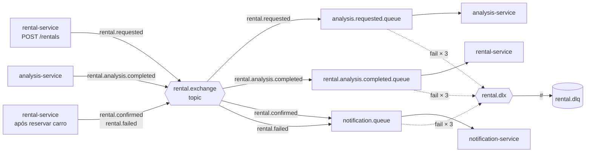
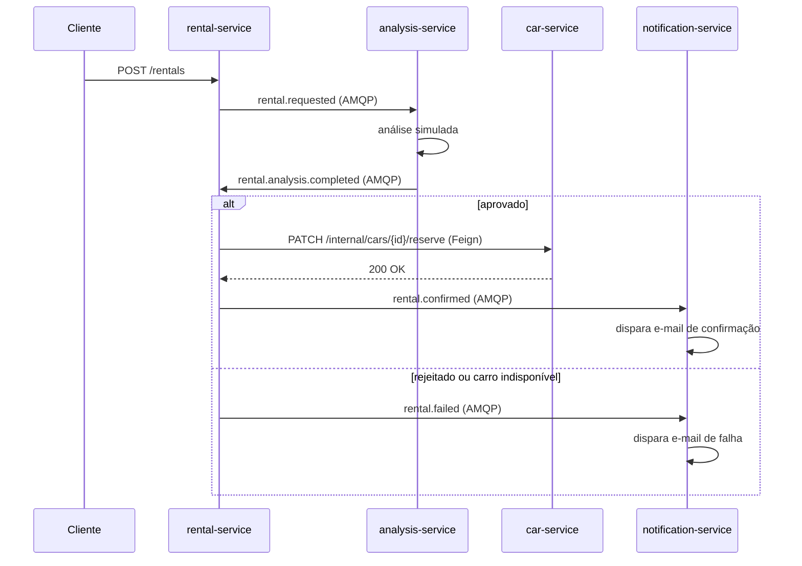

# rabbitride

[](https://github.com/GGhiaroni/rabbitride/actions/workflows/ci.yml)
Sistema de aluguel de carros event-driven com Spring Boot, microsserviços e RabbitMQ

## Arquitetura de mensageria

O coração do RabbitRide é a comunicação **assíncrona** entre microsserviços via RabbitMQ. A topologia abaixo conecta `rental-service`, `analysis-service` e `notification-service` em uma saga orquestrada.

### Topologia no broker



### Fluxo do aluguel (saga orquestrada)



### Eventos

| Routing Key | Publisher | Consumer | Payload |
|---|---|---|---|
| `rental.requested` | `rental-service` (POST /rentals) | `analysis-service` | `eventId`, `occurredAt`, `rentalId`, `userId`, `userEmail`, `carroId` |
| `rental.analysis.completed` | `analysis-service` | `rental-service` | `eventId`, `occurredAt`, `rentalId`, `resultado` (`APPROVED`/`REJECTED`), `motivo?` |
| `rental.confirmed` | `rental-service` (após reservar carro) | `notification-service` | `eventId`, `occurredAt`, `rentalId`, `userEmail`, `carroDescricao` |
| `rental.failed` | `rental-service` (análise rejeitada ou carro indisponível) | `notification-service` | `eventId`, `occurredAt`, `rentalId`, `userEmail`, `motivo` |

Todo evento traz `eventId` (UUID único) e `occurredAt` (`Instant` UTC). O `eventId` é usado pelos consumers para **idempotência** — RabbitMQ garante *at-least-once delivery*, então a mesma mensagem pode chegar duas vezes em caso de falha de rede. Cada consumer tem uma tabela `processed_event(event_id PK)` para detectar duplicatas.

### Retry + Dead Letter Queue

Toda mensagem nas queues principais (`analysis.requested.queue`, `rental.analysis.completed.queue`, `notification.queue`) tem **3 tentativas de processamento** com backoff exponencial antes de ser roteada à DLQ.

**Configuração** (em `application.yml` de cada consumer):

```yaml
spring:
  rabbitmq:
    listener:
      simple:
        retry:
          enabled: true
          max-attempts: 3
          initial-interval: 1000ms
          multiplier: 3
          max-interval: 10000ms
```

**Sequência de tentativas:**

| Tentativa | Quando | Espera após |
|---|---|---|
| 1 | imediata | 1s |
| 2 | após 1s | 3s |
| 3 | após 3s | — (próxima falha → DLQ) |

**Por que backoff exponencial:** se o consumer está falhando por sobrecarga do banco ou serviço externo, retentar imediatamente piora a situação. Esperar 1s → 3s → 9s dá tempo ao recurso se recuperar.

**O que vai pra DLQ:** mensagem após esgotar retries, **com a routing key original preservada** nos headers (`x-first-death-reason`, `x-first-death-queue`, `x-first-death-exchange`). Isso permite que devs identifiquem de qual fluxo a falha veio.

### Como inspecionar a DLQ

Via **RabbitMQ Management UI**:

1. Acesse `http://localhost:15672` (login: `rabbitride` / `rabbitride`)
2. Aba **Queues and Streams** → clique em `rental.dlq`
3. Se houver mensagens, role até **Get messages**:
    - **Ack Mode**: `Reject requeue false` (não devolve à DLQ)
    - **Encoding**: `Auto`
    - Clique em **Get Message(s)**
4. Os headers (`x-first-death-*`) revelam de onde veio a falha

Em produção, monitoramento (Prometheus/Grafana) alerta quando `rabbitmq_queue_messages_ready{queue="rental.dlq"} > 0`. Quem está oncall investiga.

## Configuração local

1. Copie as variáveis de ambiente:

```bash
   cp .env.example .env
```

2. (Opcional) ajuste credenciais e portas no `.env`.

3. Suba a infraestrutura:

```bash
   ./scripts/up.sh
```

Serviços e portas (defaults):

| Serviço   | Porta(s)       | UI / acesso                     |
|-----------|----------------|---------------------------------|
| Postgres  | 5432           | `psql -h localhost -U rabbitride` |
| Redis     | 6379           | `redis-cli`                     |
| RabbitMQ  | 5672, 15672    | http://localhost:15672          |
| MailHog   | 1025, 8025     | http://localhost:8025           |

**Parar:** `./scripts/down.sh`
**Limpar tudo (apaga dados):** `./scripts/down.sh --volumes`

⚠️ Se mudar `POSTGRES_PASSWORD` no `.env` depois de já ter subido, é necessário recriar o volume:
`./scripts/down.sh --volumes && ./scripts/up.sh`
